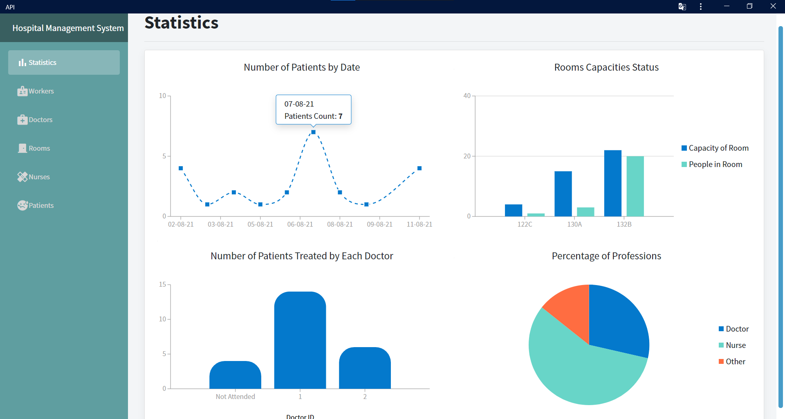
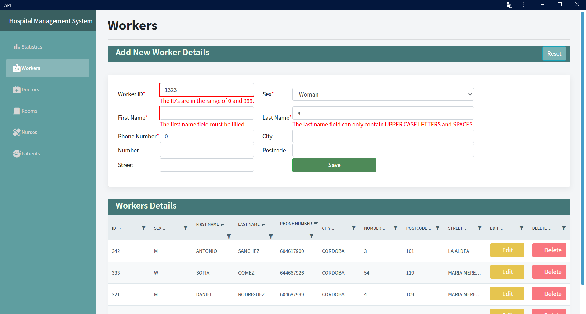
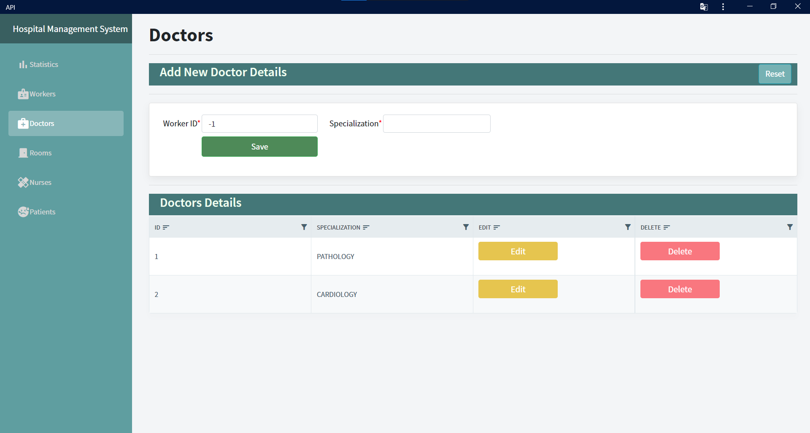
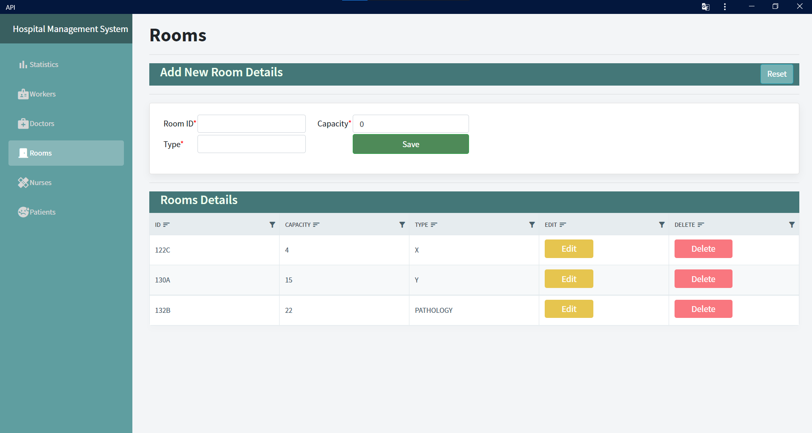
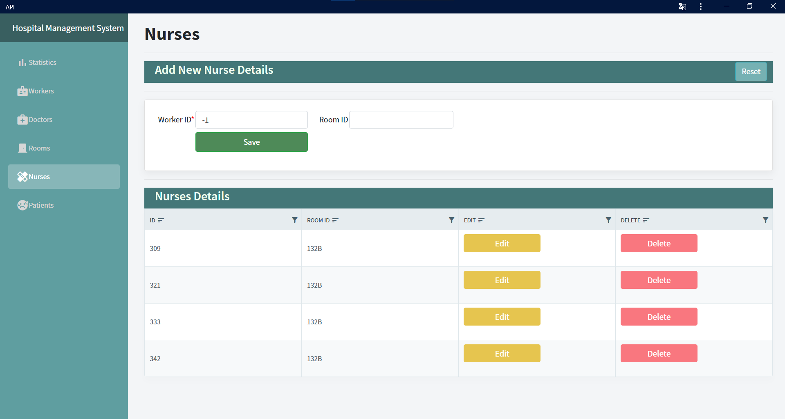
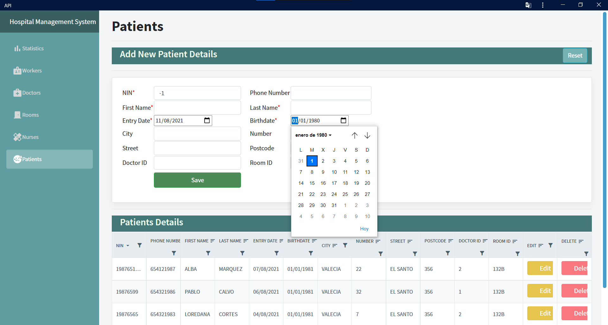
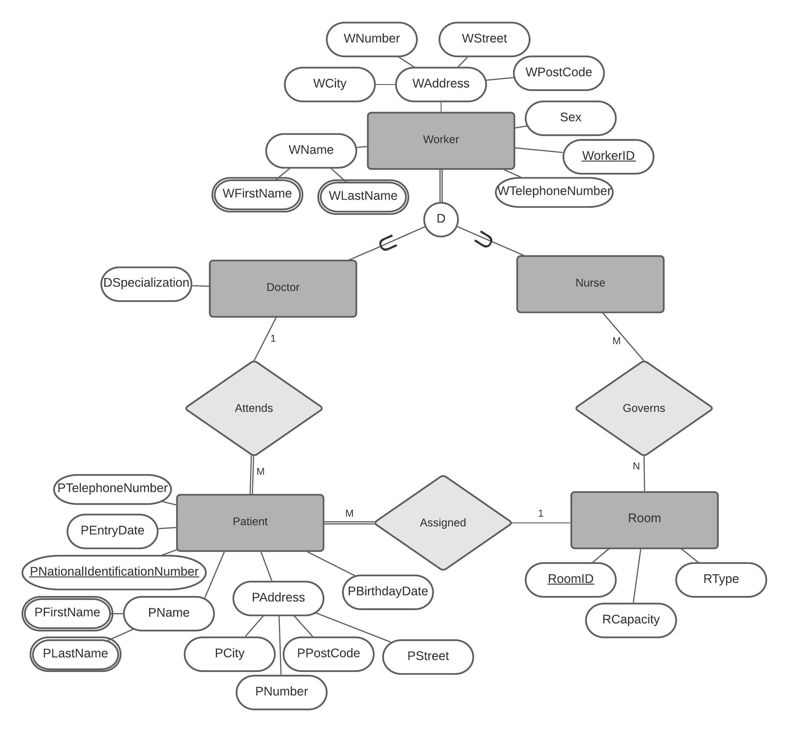
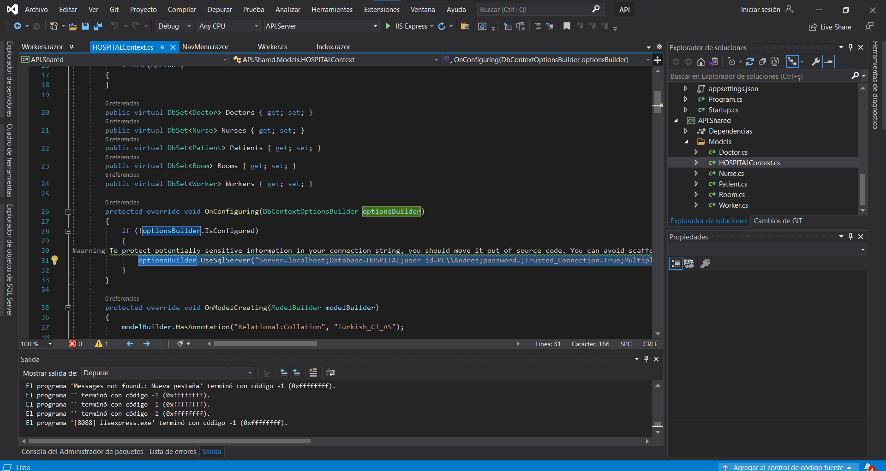

## Contents

- 1. Introduction
- 2. Design & Implementation of the Database
   - 2.a EER Diagram
   - 2.b MS SQL Scripts
- 3. Implementation of the API

 

## 1) Introduction

In this project I have tried to understand the operation of web apis using a small database which emulates being a hospital database.

For the development of the project, MS SQL, ASP.NET Core Blazor, Radzen Blazor components and Entity Framework have been used.

For now the only thing missing from this project are the validations of the forms taking into account the foreing keys and primary keys 
contraints, for now the user will not be notified about this type of errors.
I emphasize that the database will respond to the contraints, but the user will not be notified.

## Screenshots

 
 
 

 
 

## 2) Design & Implementation of the Database

### 2.a EER Diagram

A very small database has been thought of as my first start in the web APIs, it would be a database that would be used by hospital receptionists.

As you can see, it will only give priority to doctors and nurses in this database, information on other types of workers will not be taken into account.

It did not go into greater detail about the types of relationship between the entities as it was not necessary.

 

### 2.b MS SQL Scripts

As you can see in the scripts that this project contains, when creating the SQL tables some logical check contraints were set for some cases, which were also logical for me.
(taking into account that this small database is for a SMALL HOSPITAL).

Some logic triggers were also added.

 
 

## 3) Implementation of the API

First with the entity framework the DBcontext and the respective classes to the SQL tables were generated.
In the DBContext you can change the DB Connection string.

Later the controllers of the tables were generated to be able to make the HTTP requests later.

Then the razor pages were implemented and some small changes were made to the main Blazor template.

Finally, some statistics were generated regarding the HTTP data obtained on the home page.
